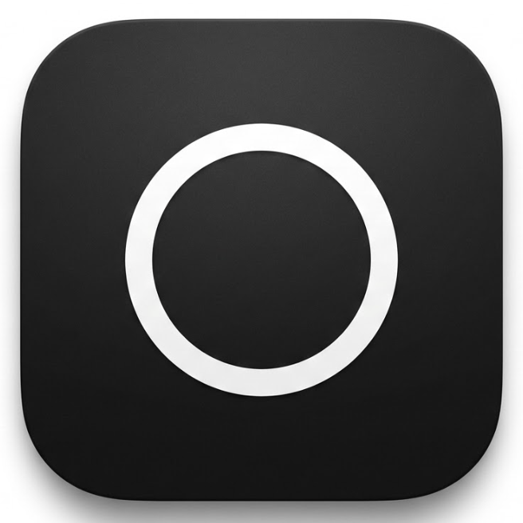

  

<h1 align="center">Omit.</h1>

  <a href="https://github.com/heisyoudan/Omit/releases/download/v1.0.0/Omit.app.zip">
    <strong>📥 Download Now (No Account Required)</strong>
  </a>
  &nbsp;•&nbsp;
  <a href="#-english">English</a> • <a href="#-中文">中文</a> • <a href="#-日本語">日本語</a>

 

  

 

---

<h2 align="center" id="-english">✦ English</h2>

  <strong>Omit noise. Return to essence.</strong> 
  A minimalist system status monitor designed exclusively for macOS.

### Philosophy
In an era of information overload, most monitoring tools overwhelm you with excessive data. **Omit chooses to subtract.** It refuses complex dashboards and configuration anxiety, displaying only the core metrics that truly affect your experience. It sits on your status bar like a piece of obsidian—quiet, deep, and instantly accessible.

### Features
* **💎 Immersive Design**: Native "Frosted Glass" HUD texture that blends perfectly with Dark Mode.
* **⚡️ Core Monitoring**: High-contrast rings for Memory & Storage, real-time load for CPU & Battery.
* **🗑️ Trash Monitor**: Check trash status and empty it with a satisfying sound effect.
* **🛡️ Ghost Permissions**: Elegant, non-intrusive permission guidance design.
* **🚀 Zero Friction**: Launch at login, low resource usage, silent guardian.

### Download & Install

1.  [**Download the latest version (Omit.zip)**](../../releases/latest)
2.  Drag the App into your **Applications** folder.
3.  **Right-click** the icon and select **Open** (this is needed for unsigned apps—completely normal & safe).
4.  Enjoy your minimal system monitor!

 
 

---

<h2 align="center" id="-中文">✦ 中文</h2>

  <strong>剔除噪音。回归本质。</strong> 
  专为 macOS 打造的极简主义系统状态监视器。

### 设计哲学
在这个充斥着过载信息的时代，大多数监控软件恨不得把电压和风扇转速都塞给你。**Omit 选择做减法。** 我们拒绝复杂的仪表盘，拒绝配置焦虑。Omit 只展示真正影响你体验的核心指标，用最克制的 UI，提供最纯粹的专注。

### 核心功能
* **💎 沉浸式设计**: 深度适配 macOS 的 HUD 级磨砂玻璃质感，与深色模式完美融合。
* **⚡️ 核心监控**: 内存与硬盘采用醒目的纯色圆环，CPU 与电池状态一目了然。
* **🗑️ 断舍离**: 实时监控废纸篓状态，支持一键清空，伴随解压的音效反馈。
* **🛡️ 幽灵态引导**: 优雅的权限请求设计，拒绝生硬的系统弹窗。
* **🚀 静默守护**: 支持开机自启，极低的资源占用。

### 下载与安装

1.  [**点击这里下载最新版本 (Omit.zip)**](../../releases/latest)
2.  将 App 拖入你的 **「应用程序」** 文件夹。
3.  **右键点击** 图标，选择 **「打开」**（独立开发的 App 首次运行需要这样操作，完全安全）。
4.  享受你的极简系统监控工具！

 
 

---

<h2 align="center" id="-日本語">✦ 日本語</h2>

  <strong>ノイズを削ぎ落とし、本質へ回帰する。</strong> 
  macOSのためにデザインされた、ミニマリストのためのシステムモニター。

### 哲学
情報過多の時代において、多くの監視ツールは過剰なデータを押し付けてきます。**Omitは「引き算」を選びました。** 複雑なダッシュボードも、設定の煩わしさもありません。体験に真に影響を与える核心的な指標だけを表示し、究極の集中を提供します。それはステータスバーにある黒曜石のように、静かで、深く、即座にアクセスできます。

### 特徴
* **💎 没入感のあるデザイン**: ダークモードと完璧に調和する、macOSネイティブな「すりガラス」質感（HUDスタイル）。
* **⚡️ コア・モニタリング**: メモリとストレージは鮮やかなリングで、CPUとバッテリー負荷はリアルタイムで表示。
* **🗑️ 断捨離**: ゴミ箱の状態を監視し、心地よい効果音とともにワンクリックで空にします。
* **🛡️ ゴースト・ガイド**: システムの無機質なポップアップを拒絶した、エレガントな権限リクエスト設計。
* **🚀 静かな守護者**: ログイン時の自動起動をサポートし、リソース消費を最小限に抑えます。

### ダウンロードとインストール

1.  [**最新バージョンをダウンロード (Omit.zip)**](../../releases/latest)
2.  アプリを **「アプリケーション」** フォルダにドラッグします。
3.  アイコンを **右クリック** して、 **「開く」** を選択します（独立開発のアプリは初回起動時にこの操作が必要です。完全に安全です）。
4.  シンプルなシステムモニターの時間をお楽しみください！

 
 

---

  <small>Designed & Developed by <strong>Tongxin</strong></small>

